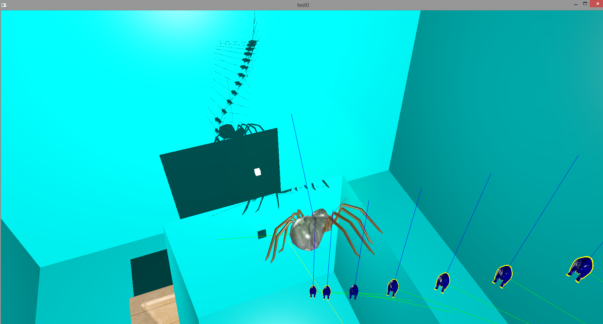

1) navigate to the solution property pages
2) under the section "VC++ Directories", 
	- add the path of the directory whose path is currently "solution_name/OpenGL Libraries/include"
	  to the list of Include Directories
	- add the path of the directory whose path is currently "solution_name/OpenGL Libraries/lib"
	  to the list of Library Directories
3) under the section "Linker/Input",
	- add "glfw3.lib" and "opengl32.lib" and "assimp-vc140-mt.lib" to the list of Additional Dependencies
4) add all files inside "solution_name/OpenGL Libraries/src" to the project if they are not currently included or are invalid

